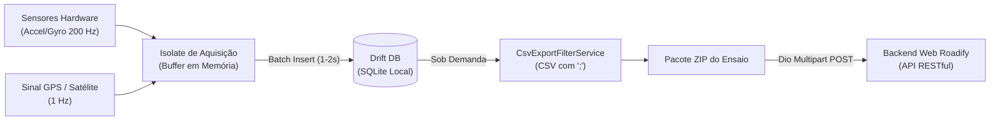

# 🚗 Roadify Mobile

<div align="center">

[](https://flutter.dev)
[](https://dart.dev)
[](#-plataformas-suportadas)
[](#-arquitetura-do-projeto)
[-orange)](#-persistência-local-com-drift)
[](#-licença)

**Triagem Inteligente e de Baixo Custo de Pavimentos Asfálticos com Smartphones**

[Visão Geral](#-visão-geral) •
[Design System](#-design-system--ergonomia) •
[Funcionalidades](#-funcionalidades-chave) •
[Arquitetura](#-arquitetura-do-projeto) •
[Equipe](#-equipe-e-alocação-de-features) •
[Como Executar](#-como-executar-o-projeto) •
[Dados CSV](#-especificação-dos-dados-exportados-csv)

</div>

---

## 📌 Visão Geral

O **Roadify Mobile** é uma solução móvel desenvolvida em Flutter projetada para democratizar e baratear o monitoramento contínuo de rodovias e vias urbanas. Ao transformar smartphones comerciais acoplados ao para-brisa em estações inerciais e de geolocalização, a plataforma viabiliza a triagem preventiva de irregularidades asfálticas em larga escala.

---

## 🎨 Design System & Ergonomia

Projetado especificamente para as condições adversas de iluminação no interior de veículos sob radiação solar direta:

* ☀️ **Daylight Light Mode (Padrão de Alto Contraste):** Fundo branco puro (`#FFFFFF`) e cinza suave (`#F8FAFC`), contraste tipográfico elevado (`GoogleFonts.inter`) e identidade visual em **Verde Floresta / Petróleo** (`#134E3F`) com acentos em **Verde Limão** (`#A3E635`).
* 💊 **Pill-Shaped Floating Dock (Estilo Galaxy OneUI & iOS):** Barra de navegação inferior flutuante com cantos arredondados (`32px`), elevação suave e efeito de vidro translúcido (*frosted glass* via `BackdropFilter`), garantindo ergonomia para alcance com o polegar.

---

## ⚡ Funcionalidades Chave

1. 🎯 **Nível Bolha Digital com Tara Angular:** Alinhamento tridimensional físico do smartphone ao suporte veicular com mira concêntrica circular ($\le 0,5^\circ$ de tolerância) e calibração de compensação de inclinação do para-brisa.
2. ⏱️ **Cockpit HUD de Coleta Contínua:** Velocímetro digital, cronômetro, odômetro acumulado em tempo real, osciloscópio dos eixos inerciais $X, Y, Z$ com buffer circular leve e modo *Wakelock* (tela sempre ativa).
3. 📸 **Captura Rápida de Anomalias:** Botão de foto instantânea (< 500 ms) vinculando georreferenciamento e leitura inercial do instante do impacto na pista.
4. 💾 **Persistência Robusta com Drift (SQLite):** Ingestão contínua a 100/200 Hz utilizando buffers temporários e transações em lote (*batch insert*), garantindo integridade ACID mesmo em caso de desligamento abrupto ou superaquecimento.
5. 📊 **Filtro Exportador CSV (`;`) e Pacotes ZIP:** Desacoplamento via `CsvExportFilterService` que compila os ensaios em `aceleracao.csv`, `localizacao.csv` e `config.csv` (com delimitador `;` e codificação UTF-8) e compacta em arquivos `.zip`.
6. ☁️ **Sincronização em Nuvem via RESTful API:** Upload multipart em segundo plano para o servidor Roadify com suporte à retomada e atualização reativa do status (*Pendente* vs *Sincronizado*).
7. 🛡️ **Sessão Segura e JWT:** Armazenamento seguro de credenciais e tokens em hardware (`flutter_secure_storage` com Android Keystore e iOS Keychain).

---

## 🏗️ Arquitetura do Projeto

O projeto adota o padrão **MVVM Feature-First**, desacoplando totalmente as telas e ViewModels de cada funcionalidade para permitir desenvolvimento paralelo sem conflitos e entregas compiláveis e navegáveis a cada Sprint:

```text
roadify_app/lib/
├── core/                         # Infraestrutura transversal e utilitários globais
│   ├── theme/                    # FlexColorScheme, tokens de cores, dimensões e ThemeExtension
│   ├── navigation/               # PillDockScaffold (Barra flutuante OneUI / iOS)
│   ├── database/                 # Drift (SQLite): AppDatabase, Tables (Runs, Sensors, GPS) e DAOs
│   ├── network/                  # Cliente HTTP Dio, Interceptors de JWT e Endpoints
│   └── di/                       # Injeção de dependências (GetIt)
│
├── features/                     # Módulos de domínio independentes
│   ├── home/                     # Overview executivo, diagnóstico de disco e status de sincronização
│   │   ├── presentation/
│   │   └── viewmodels/
│   │
│   ├── coleta/                   # Wizard de medição, parâmetros e HUD de gravação em pista
│   │   ├── presentation/
│   │   ├── viewmodels/
│   │   └── services/             # SensorStreamService e Isolate de amostragem
│   │
│   ├── sensores/                 # Nível Bolha Digital (mira/tara) e Sinais inerciais ao vivo
│   │   ├── presentation/
│   │   ├── viewmodels/
│   │   └── services/             # SensorOrientationService
│   │
│   ├── dados/                    # Histórico local, CsvExportFilterService, ZIP e Upload REST
│   │   ├── presentation/
│   │   ├── viewmodels/
│   │   └── services/             # CsvExportFilterService, ZipService, UploadService
│   │
│   └── auth_config/              # Login, Cadastro, Termos de Uso, Temas e Configurações Gerais
│       ├── presentation/
│       └── viewmodels/
│
└── main.dart                     # Ponto de entrada do aplicativo
```

### Fluxo de Aquisição e Persistência de Dados



---

## 👥 Equipe e Alocação de Features

O desenvolvimento é distribuído entre 5 integrantes com responsabilidades ponta a ponta:

| Integrante | Papel no Projeto | Feature Atribuída | Responsabilidades Principais |
| :--- | :--- | :--- | :--- |
| **Valber** | Tech Lead & Integrador | `core` & **`home`** | Arquitetura MVVM, Temas globais (`flex_color_scheme`), `PillDockScaffold`, setup do banco Drift e tela inicial com overview e diagnóstico de armazenamento. |
| **Lucas** | Desenvolvedor Fullstack | **`coleta`** | Wizard de parâmetros da medição, odômetro, cockpit HUD de condução, Isolates de aquisição inercial contínua. |
| **Allan** | Desenvolvedor Fullstack | **`sensores`** | Nível Bolha Digital (mira gráfica, tolerância de alinhamento e tara de ângulos) e gráficos osciloscópicos ao vivo. |
| **Humberto** | Desenvolvedor Fullstack | **`dados`** | Gestão de gravações locais, serviço `CsvExportFilterService` (Drift $\rightarrow$ CSV `;`), compactação ZIP e upload via API RESTful. |
| **Tiago** | Desenvolvedor Fullstack | **`auth_config`** | Telas de Login, Cadastro, Termos de Uso, Configurações Gerais (seletor Claro/Escuro/Sistema, endpoints de API e i18n). |

---

## 🚀 Como Executar o Projeto

### Pré-requisitos
* **Flutter SDK:** $\ge$ 3.24.0 (Canal Stable)
* **Dart SDK:** $\ge$ 3.5.0
* **Dispositivo ou Emulador:** Android (API 26+) ou iOS (iOS 15+)

### Passo a Passo

1. **Clonar o Repositório:**
   ```bash
   git clone https://github.com/ValberSales/roadify-mobile.git
   cd roadify-mobile/roadify_app
   ```

2. **Instalar Dependências:**
   ```bash
   flutter pub get
   ```

3. **Gerar Códigos de Banco e Serialização (Build Runner):**
   ```bash
   dart run build_runner build --delete-conflicting-outputs
   ```

4. **Executar a Aplicação:**
   ```bash
   flutter run
   ```

---

## 🧪 Qualidade de Código e Testes

O projeto segue padrões rígidos de qualidade de código, com análise estática e testes de widgets integrados:

```bash
# Executar análise estática de linter
flutter analyze

# Executar suíte de testes unitários e de widgets
flutter test
```

---

## 📄 Especificação dos Dados Exportados (CSV)

Todos os ensaios exportados pelo aplicativo geram arquivos tabulares estruturados com **separador ponto e vírgula (`;`)** e codificação **UTF-8**:

### 1. `aceleracao.csv`
Série temporal inercial a 100/200 Hz:
```text
timestamp;accel_x;accel_y;accel_z;gyro_x;gyro_y;gyro_z
2026-09-22 14:32:01.005;-0.042;0.115;9.812;0.001;-0.002;0.000
2026-09-22 14:32:01.010;-0.038;0.120;9.808;0.002;-0.001;0.001
```

### 2. `localizacao.csv`
Trajetória georreferenciada e velocidade:
```text
timestamp;latitude;longitude;velocidade_kmh;precisao_m
2026-09-22 14:32:01.000;-23.550520;-46.633308;58.4;3.2
2026-09-22 14:32:02.000;-23.550610;-46.633412;58.8;3.0
```

### 3. `config.csv`
Metadados do veículo, instrumento e calibração:
```text
vendor;model;phone_orientation;vehicle;odometer_km;sample_rate_accel_hz;sample_rate_gps_ms;level_pitch_offset_deg;level_roll_offset_deg
Samsung;Galaxy S23;Portrait;Toyota Hilux 2024;45200;200;1000;1.24;-0.35
```

---

## 📚 Documentação Complementar

* 📋 **[Requisitos Funcionais e Sistêmicos (RF / RNF / RS)](file:///Volumes/Valber/Desenvolvmento/ProjetoOficina/REQUISITOS_FUNCIONAIS_E_SISTEMICOS.md):** Especificação detalhada dos 11 requisitos funcionais, não-funcionais atrelados e requisitos de sistema globais.
* 🗓️ **[Planejamento de Sprints & ClickUp](file:///Volumes/Valber/Desenvolvmento/ProjetoOficina/REQUISITOS_SISTEMA_ROADIFY.md):** Divisão completa das 4 Sprints de 15 dias com tarefas detalhadas e critérios de aceite BDD.
* 🎨 **[Guia de Temas e Design System](file:///Volumes/Valber/Desenvolvmento/ProjetoOficina/roadify_app/README.md):** Como consumir as extensões de tema, paleta de cores e tipografia no código Flutter.

---

## 📜 Licença

Este projeto é desenvolvido no âmbito da disciplina de Projeto de Oficina de Engenharia / Computação. Distribuído sob a licença MIT. Consulte `LICENSE` para mais detalhes.
